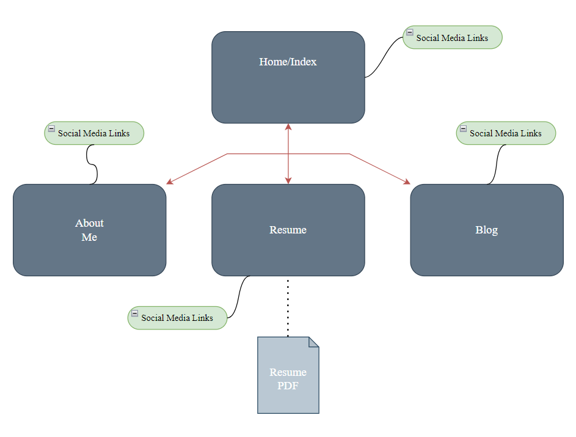
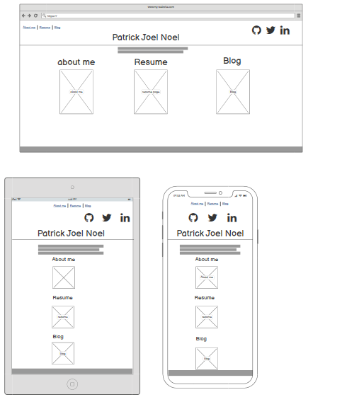
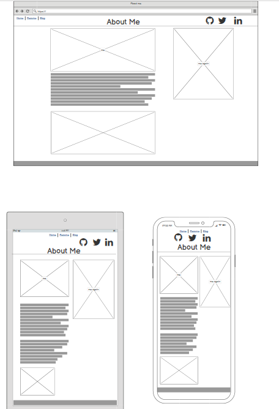
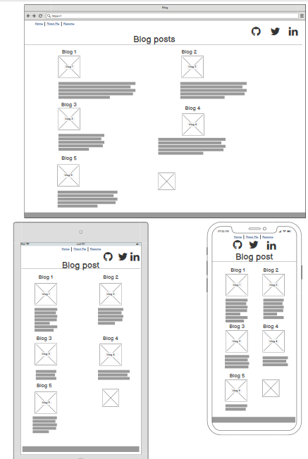
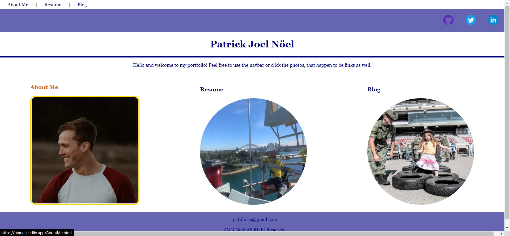
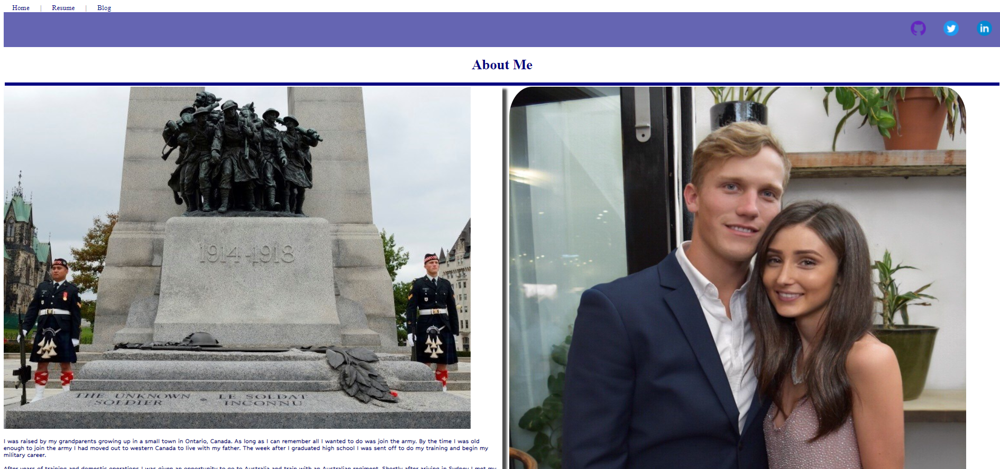
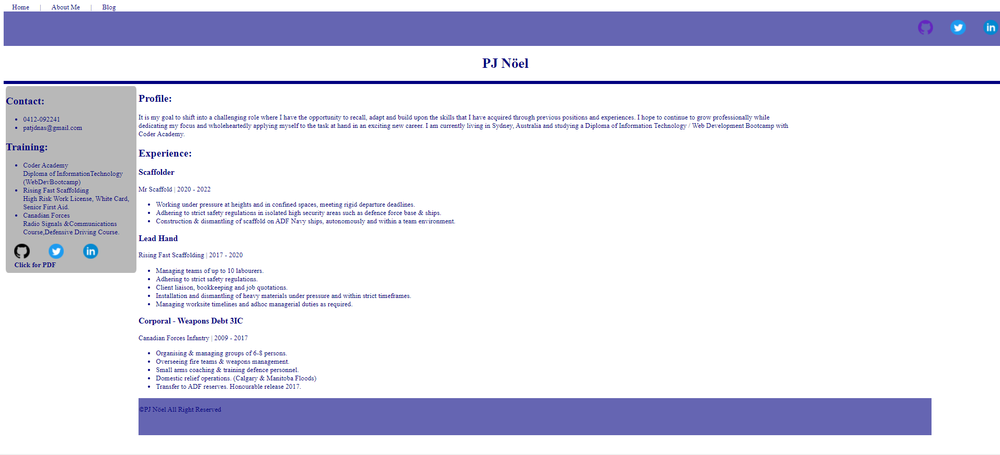
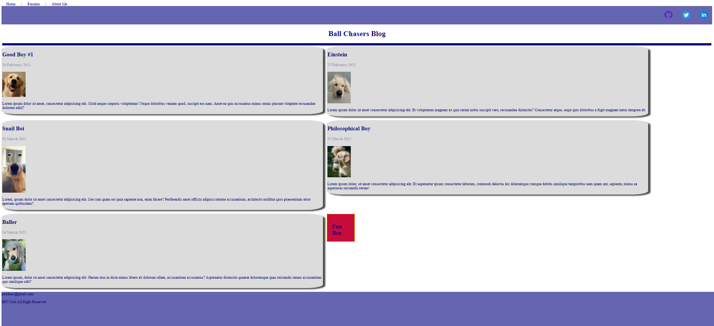

# PJ Nöel

## Link to Portfolio Website URL

[PJ Nöel Netlify](<https://pjnoel.netlify.app/>)

## Link to Github Repo

[github repo](<https://github.com/patjd0/src-portfolio>)

### Objective

The purpose of this website is to introduce myself to potential employers and showcase a sample of my skills as a junior web developer.

### Content & Features

My website portfolio contains an example of my work as well as details about myself in four HTML based pages:

* The home page  acts as a directory as well as showcasing a reactive design.

* The about me page tells the reader where I come from and how I have come to this industry, along with some images to paint a better picture.

* The resume page is exactly that, it is my resume with links to my social media and a PDF of my resume itself.
  
* The blog page is purely to demonstrate my work with five blog posts and photos of my dogs in each. I added in a reactive "fun"box at the end for those who can't read latin.

### Site Map

## Site Overview

### Home

### About Me

### Resume

### Blog

## Audience

This website is targeted for future employers and fellow junior web developers, to not only help secure employment for myself but also help others who may be new to the industry.

## Tech Stack

My website is made up entirely out of HTML and CSS, I plan to continue with this portfolio as I learn new languages and advance in this industry.
